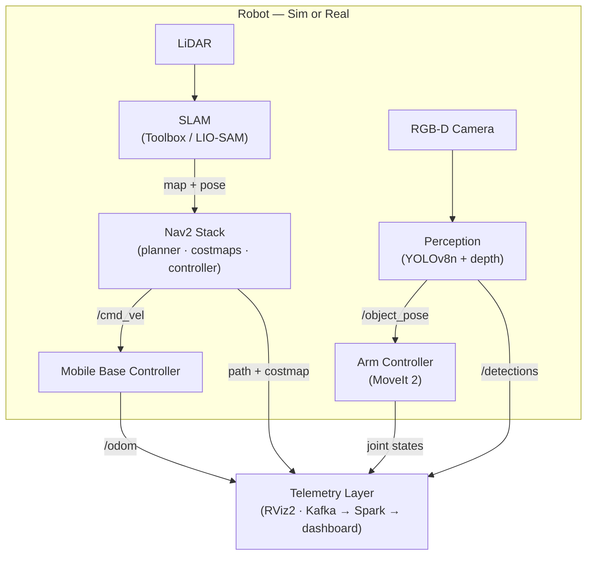

# System Architecture

This document describes the intended system architecture for the RCC Summer 2026 mobile manipulation project. Update it via PR as open decisions are resolved.

---

## System Overview

A ROS 2-based mobile manipulation robot that:

1. Localizes itself and navigates autonomously to a target location (SLAM + Nav2)
2. Detects and localizes a target object using its RGB-D camera and YOLOv8n
3. Picks and places the object using a mounted robotic arm (MoveIt 2)
4. Streams telemetry data to a live dashboard throughout

The system is developed and validated in simulation first. Sim-to-real transfer to a physical Yahboom ROSMASTER M3 Pro is a stretch goal for Week 8.

---

## Component Diagram

---

## Components

### Robot Platform

- **Base:** Differential-drive wheeled base (Yahboom ROSMASTER M3 Pro or sim equivalent)
- **Arm:** Robotic arm mounted on base (DOF from M3 Pro URDF)
- **Sensors:**
  - 2D or 3D LiDAR (SLAM + obstacle avoidance costmap)
  - RGB-D camera (object detection + depth projection)
  - IMU: **[OPEN]** — must confirm whether M3 Pro includes a working IMU before committing to LIO-SAM

---

### Simulation

**[OPEN: Gazebo Harmonic vs. MuJoCo / RoboSuite]**

| Option | Pros | Cons |
|---|---|---|
| Gazebo Harmonic | Native ROS 2 integration; Nav2 + MoveIt 2 tooling works out of the box; Basavaraj has direct experience | Less mature imitation learning ecosystem |
| MuJoCo / RoboSuite | Strong fit for imitation learning (RoboMimic); Alexander's proposed stack | Requires significant glue code to integrate Nav2; adds complexity |

**Recommendation:** Use Gazebo Harmonic as the primary simulation environment — it has the best compatibility with Nav2, MoveIt 2, and the full ROS 2 toolchain. If the team wants to pursue imitation learning (behavior cloning via RoboMimic), scope it as a parallel workstream with MuJoCo that shares only the perception code. Do not try to run both in the same simulation loop.

---

### SLAM

**[OPEN: SLAM Toolbox vs. LIO-SAM]**

| Option | Pros | Cons | Requirement |
|---|---|---|---|
| SLAM Toolbox | ROS 2 native; well-supported; simpler setup; works in sim and on hardware | LiDAR-only (no IMU fusion) | LiDAR only |
| LIO-SAM | Tightly-coupled LiDAR + IMU fusion; robust in dynamic environments | More complex setup; needs a calibrated IMU | LiDAR + IMU |

**Recommendation:** Default to SLAM Toolbox. LIO-SAM is not necessary for an indoor warehouse environment, and the added complexity risks blocking Week 3. Switch to LIO-SAM only if Alexander confirms the M3 Pro has a working IMU and the team wants the more robust localization for sim-to-real.

**Action item (Week 1):** Alexander confirms M3 Pro IMU → Basavaraj updates SLAM choice → team closes this decision in the kickoff standup.

---

### Navigation

- **Nav2** full stack
- Costmap layers: static map layer + obstacle layer (from LiDAR)
- Global planner: NavFn or Smac Hybrid-A* (tune for warehouse environment)
- Local planner: DWB or MPPI (MPPI preferred for smoother trajectories near obstacles)
- Operator sends a `geometry_msgs/PoseStamped` goal; Nav2 executes

---

### Perception

1. YOLOv8n inference on RGB color image → 2D bounding boxes (`/detections`)
2. Bounding box center projected onto aligned depth image → 3D point in camera frame
3. TF transform to map frame → `/object_pose` (`geometry_msgs/PoseStamped`)

Notes:
- YOLOv8n is CPU-viable (nano model); no GPU required
- For the sim demo, train or use a pretrained model on a single object class (e.g., a box or can)
- Confidence threshold and NMS parameters will need tuning per environment

---

### Manipulation

- **MoveIt 2** motion planning
- Grasp pose computed from 3D object centroid + fixed offset (simplified; no full grasp pose estimation)
- Motion sequence: home → pre-grasp → grasp (close gripper) → lift → transport → place → open gripper → home
- Collision objects for the environment loaded into MoveIt 2 planning scene from the Nav2 costmap or manually

---

### Telemetry

**Minimum (all members):**
- RViz2: live robot pose, LiDAR scan, costmap, planned path, arm joint states, detection markers

**Extended pipeline [OPEN — Durraiyah owns]:**
- ROS 2 topic subscribers (Python / rclpy) → structured log files or Kafka topics
- Kafka → Spark Streaming → Power BI or custom web dashboard
- Candidate topics to stream: `/odom`, `/amcl_pose`, `/scan`, `/joint_states`, `/detections`, navigation events

Scope (what gets streamed, what analytics are shown) to be decided in Week 1. At minimum, Durraiyah delivers structured logging of robot pose and detection events by Week 4.

---

## Open Technical Decisions

| Decision | Options | Blocking? | Decision Owner |
|---|---|---|---|
| Simulator | Gazebo Harmonic vs. MuJoCo/RoboSuite | Yes — blocks Weeks 2+ | Alexander + Basavaraj |
| SLAM algorithm | SLAM Toolbox vs. LIO-SAM | Yes — blocks Week 3 | Basavaraj (after Alexander confirms IMU) |
| Sim-to-real scope | Week 8 deliverable vs. stretch goal | Yes — affects plan | Nick |
| Telemetry pipeline | RViz2 only vs. Kafka/Spark | No — parallelizable | Durraiyah |
| Imitation learning | In scope vs. dropped | No — affects Alexander Weeks 1–4 | Alexander |

---

## Sim-to-Real Strategy

Physical target: **Yahboom ROSMASTER M3 Pro** (Alexander's hardware)
- Has LiDAR, RGB-D camera, robotic arm, and ROS 2 support
- URDF available from manufacturer (or extractable from manufacturer ROS package)

Transfer steps:
1. Develop URDF for simulation using the M3 Pro's exact dimensions and joint layout from day one — this minimizes the transfer gap
2. Validate all software stacks in simulation through Week 7
3. Week 7 (stretch): bring up ROS 2 on physical M3 Pro, verify sensor topics match URDF expectations
4. Retune Nav2 costmap and planner parameters for physical odometry noise and LiDAR characteristics
5. Retune YOLOv8n confidence threshold for real lighting conditions
6. Week 8 (stretch): live demo on hardware

The simulation demo is the **primary deliverable**. Sim-to-real is explicitly a stretch goal and will be cut if simulation milestones slip.

---

*Open a PR to update this document when decisions are made. Tag the relevant team member as reviewer.*
